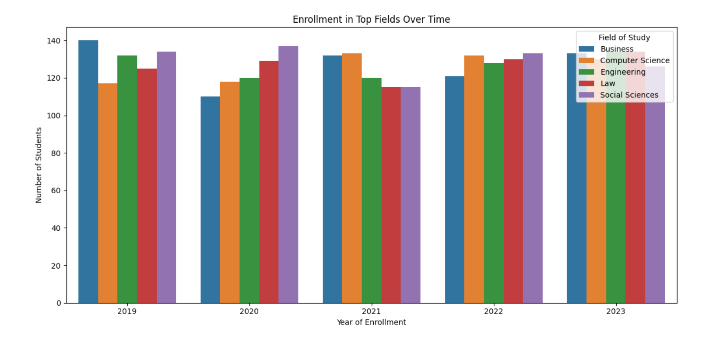
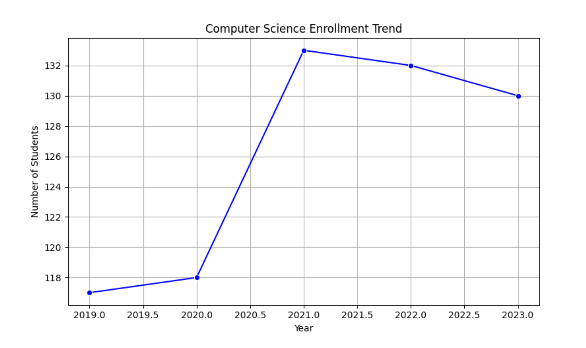
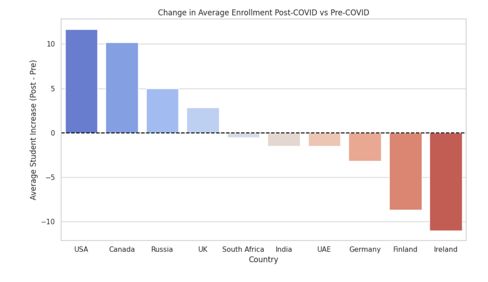

# International Student Trends (2019–2023)

**Dataset:** 5,000 international students  
**Notebook on Kaggle:** [View here](https://lnkd.in/dTi77JiD)  
**YouTube Video (Norwegian):** [Watch here](https://lnkd.in/dB98eKNu)

---

## 📌 Goal
To explore where international students are going, what they are studying, and how these patterns changed between 2019–2023.  

---

## 📊 Key Insights
1. **Is Computer Science still the top choice?**  
   Yes — it showed the biggest growth. Medicine and Law also grew, while Arts and Social Sciences dipped slightly.  

2. **How are countries trending overall?**  
   Enrollment dipped in 2020–2021 (likely due to COVID). UAE remained strong, while Ireland and Finland fluctuated more.  

3. **Which destinations grew post-COVID?**  
   USA and Canada rebounded strongly. Several European destinations declined.  

4. **Developing country perspective (India):**  
   Indian students shifted away from Russia after 2021, while USA, UAE, and Canada stayed consistent. Ireland saw a rebound in 2023.  

5. **Why go abroad?**  
   Top reasons: quality of life, university rankings, and scholarships. Job opportunities and political stability also mattered.  

---

## 🔧 Tools
- Python (Pandas, Matplotlib, Seaborn)  
- Jupyter Notebook  

---

## 🖼️ Visuals

### 1. Enrollment in Top Fields
  

---

### 2. Computer Science Enrollment Trend
  

---

### 3. Change in Enrollment Pre vs Post-COVID
  

---

## 📂 Repository Structure

